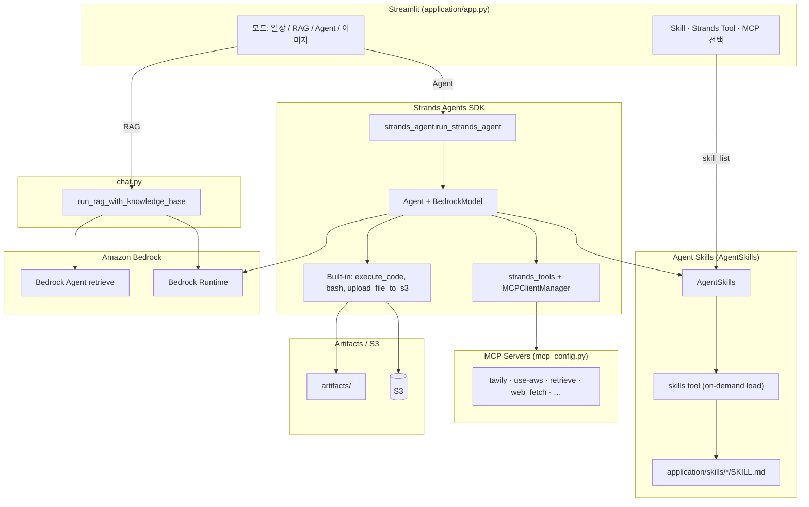

# Strands Agent에서 SKILL 활용하기

여기에서는 [Strands agent](https://strandsagents.com/0.1.x/)에서 [Agent Skills](https://platform.claude.com/docs/ko/agents-and-tools/agent-skills/overview)을 활용하는 것을 설명합니다. Strands Agent는 AI agent 구축 및 실행을 위해 설계된 오픈소스 SDK입니다. 계획(planning), 사고 연결(chaining thoughts), 도구 호출, Reflection과 같은 agent 기능을 쉽게 활용할 수 있습니다. 이를 통해 LLM model과 tool을 연결하며, 모델의 추론 능력을 이용하여 도구를 계획하고 실행합니다. 현재 Amazon Bedrock, Anthropic, Meta의 모델을 지원하며, Accenture, Anthropic, Meta와 같은 기업들이 참여하고 있습니다. 

여기에서 사용하는 architecture는 아래와 같습니다. Streamlit 애플리케이션은 **로컬**에서 실행하고, RAG·스토리지·공유 URL 등에 필요한 AWS 백엔드는 [installer.py](./installer.py)로 프로비저닝합니다. OpenSearch, S3, CloudFront, Knowledge Base는 `agent-skills` 등과 **공유**할 수 있으며, Agent가 생성하는 그림이나 문서는 S3와 CloudFront URL로 공유됩니다. MCP server/client를 이용해 인터넷 검색(Tavily), RAG(Knowledge Base), AWS tools(use-aws), Notion 등을 활용할 수 있습니다. 여기서 활용하는 architecture는 아래와 같습니다.


## Agent Skills

[Agent Skills](https://agentskills.io/specification)은 AI agent에게 특정 작업 수행 방법을 가르치는 재사용 가능한 지침 패키지입니다. 각 스킬은 `SKILL.md` 파일로 구성되며, YAML 프론트매터(name, description)와 상세 지침(워크플로, 코드 패턴 등)으로 이루어져 있습니다.


### Operation Architecture



| 모드 | 모듈 | 설명 |
|------|------|------|
| 일상적인 대화 | `chat.general_conversation` | 대화 이력 + Bedrock Runtime `invoke_model_with_response_stream` 스트리밍 |
| RAG | `chat.run_rag_with_knowledge_base` | Bedrock Agent Runtime `retrieve`로 Knowledge Base 검색 후 Bedrock Runtime으로 답변 생성 |
| **Agent** | `strands_agent.run_strands_agent` | Strands SDK + AgentSkills + strands_tools + MCP |
| 이미지 분석 | `chat.summarize_image` | Bedrock 멀티모달 (이미지 + 텍스트) 분석, markdown artifact S3 업로드 |


### Progressive Disclosure

시스템 프롬프트에는 스킬의 **이름과 설명만** XML 형태로 포함하고, 상세 지침은 agent가 `skills` 도구를 호출하여 **필요할 때만** 로드합니다. ([Strands AgentSkills](https://strandsagents.com/docs/user-guide/concepts/plugins/skills/)) 이를 통해 프롬프트 크기를 최소화하면서도 agent가 다양한 스킬을 활용할 수 있습니다.

```xml
<available_skills>
  <skill>
    <name>pdf</name>
    <description>PDF 파일 읽기/병합/분할/OCR/폼 처리 등</description>
  </skill>
  ...
</available_skills>
```

각 스킬은 `SKILL.md` 파일 하나가 핵심이며, 필요에 따라 `scripts/`, `references/`, `assets/` 등의 보조 폴더를 포함할 수 있습니다.

```text
application/skills/
├── pdf/
│   ├── SKILL.md          # YAML 프론트매터 + 상세 지침
│   └── assets/           # 폰트 등 보조 리소스
├── notion/
│   └── SKILL.md
└── xlsx/
    └── SKILL.md
```

`SKILL.md`는 아래와 같이 YAML 프론트매터와 마크다운 본문으로 구성됩니다.

```markdown
---
name: pdf
description: PDF 파일 처리를 위한 스킬
---

# PDF Processing Guide

## Overview
이 가이드는 Python 라이브러리를 사용한 PDF 처리 작업을 다룹니다.
execute_code 도구로 아래의 Python 코드를 실행하세요.
...
```

### 스킬의 종류

스킬은 `application/skills/` 아래에 `SKILL.md`를 포함한 디렉터리로 관리합니다. Agent 모드에서 Streamlit UI로 활성화할 스킬을 선택하면 `AgentSkills`에 전달됩니다.

| 스킬 | 설명 |
|------|------|
| pdf | PDF 읽기/병합/분할/OCR/폼 처리 |
| notion | Notion API를 통한 페이지/DB/블록 관리 |
| memory-manager | MEMORY.md 기반 대화 메모리 관리 |
| docx | Word 문서 생성/편집/분석 |
| xlsx | 스프레드시트 작업/모델링 |
| pptx | PowerPoint 읽기/편집/생성 |
| myslide | AWS 테마 프레젠테이션 생성 |
| retrieve | Bedrock Knowledge Base RAG 검색 |
| skill-creator | 새로운 스킬 설계/패키징 가이드 |
| seoul-subway | 서울 지하철 실시간 도착/경로/운행 정보 |

### 스킬의 동작 흐름

[strands_agent.py](./application/strands_agent.py)에서 Strands SDK `AgentSkills`로 스킬을 연결합니다.

1. **스킬 선택**: Streamlit UI에서 활성화할 스킬을 선택하면 `skill_list`가 `create_agent()`에 전달됩니다.
2. **메타데이터 주입**: `AgentSkills`가 선택된 `application/skills/*/SKILL.md`의 이름/설명을 system prompt에 `<available_skills>` XML로 포함합니다.
3. **지침 로드**: 사용자 요청에 맞는 스킬이 있으면 agent가 `skills` 도구를 호출하여 상세 지침을 로드합니다.
4. **작업 수행**: 로드된 지침에 따라 `execute_code`, `file_read`, `file_write`, `bash` 등의 도구를 사용하여 작업을 수행합니다.
5. **결과 전달**: 결과 파일은 `artifacts/` 디렉터리에 저장하고, 필요 시 `upload_file_to_s3`로 업로드하여 URL을 제공합니다.

활성화할 스킬은 `config.json`의 `default_skills`에서 설정하며, Streamlit UI에서도 체크박스로 선택할 수 있습니다.

### AgentSkills 구현

[strands_agent.py](./application/strands_agent.py)에서 Strands SDK `AgentSkills`로 스킬을 연결합니다. 별도의 `skill.py`나 `get_skill_instructions` 도구 없이, SDK가 `skills` 도구와 system prompt 메타데이터 주입을 처리합니다.

**1. UI에서 스킬 목록 조회** — `Skill.from_file()`로 `application/skills/`를 스캔합니다.

```python
def available_skills() -> list[dict]:
    for entry in sorted(os.listdir(SKILLS_DIR)):
        skill_dir = os.path.join(SKILLS_DIR, entry)
        if os.path.isfile(os.path.join(skill_dir, "SKILL.md")):
            loaded = Skill.from_file(skill_dir)
            result.append({"name": loaded.name, "description": loaded.description, "dir": entry})
```

**2. skill 이름 → 디렉터리 경로 변환** — UI/config에는 `SKILL.md`의 `name`(예: `seoul-subway`)이 저장되고, 실제 폴더명(예: `subway`)과 다를 수 있어 경로를 해석합니다.

```python
def skill_dirs_from_list(skill_list: list[str]) -> list[str]:
    dirs = []
    for key in skill_list:
        path = resolve_skill_dir(key)  # name 또는 dir → application/skills/<dir>
        if path:
            dirs.append(path)
    return dirs
```

**3. Agent 생성** — 선택된 스킬 디렉터리를 `AgentSkills`에 전달하고, `plugins` 파라미터로 등록합니다.

```python
def create_agent(strands_tools: list[str], mcp_servers: list[str], skill_list: list[str]):
    tools = update_tools(strands_tools, mcp_servers)  # execute_code, bash, file_read, file_write, MCP …
    skills_sources = skill_dirs_from_list(skill_list)

    skills_plugin = AgentSkills(skills=skills_sources) if skills_sources else None

    agent = Agent(
        model=get_model(),
        system_prompt=BASE_SYSTEM_PROMPT,
        tools=tools,
        plugins=[skills_plugin] if skills_plugin else [],
        conversation_manager=conversation_manager,
    )
    return agent
```

**4. skill 리소스 접근용 도구** — `AgentSkills`는 skill 활성화만 담당합니다. `scripts/`, `references/`, `assets/` 파일 접근과 코드 실행은 agent에 등록된 도구가 처리합니다.

| 역할 | 도구 | 제공 |
|------|------|------|
| skill 활성화 | `skills` | `AgentSkills` (자동 등록) |
| 파일 읽기/쓰기 | `file_read`, `file_write` | strands_tools |
| Python 실행 | `execute_code` | strands_agent 내장 |
| 셸/Node 실행 | `bash` | strands_agent 내장 |
| HTTP API 호출 | `http_request` | strands_tools (선택) |
| 결과 업로드 | `upload_file_to_s3` | strands_agent 내장 |

생성 파일은 repo 루트 `artifacts/`에 저장합니다 (`ARTIFACTS_DIR`).


## Strands Agent 활용 방법

### Streamlit에서 agent의 실행

[app.py](./application/app.py)에서 Agent 모드를 선택하면 `strands_agent.run_strands_agent()`를 호출합니다. 선택된 스킬 목록(`skill_list`)이 `AgentSkills`로 전달됩니다.

```python
if mode == 'Agent':
    with st.status("thinking...", expanded=True, state="running") as status:
        notification_queue = NotificationQueue(container=status)
        skill_list = selected_skills if selected_skills else []

        response, image_urls = asyncio.run(strands_agent.run_strands_agent(
            query=prompt,
            strands_tools=selected_strands_tools,
            mcp_servers=selected_mcp_servers,
            skill_list=skill_list,
            notification_queue=notification_queue))
```

### Agent의 실행

[strands_agent.py](./application/strands_agent.py)의 `run_strands_agent()`가 agent를 생성·실행합니다. 스킬 구성이 바뀌면 agent를 재생성합니다.

```python
async def run_strands_agent(query, strands_tools, mcp_servers, skill_list, notification_queue):
    if selected_strands_tools != strands_tools or selected_mcp_servers != mcp_servers or selected_skill_list != skill_list:
        agent = create_agent(strands_tools, mcp_servers, skill_list)
        mcp_manager.start_agent_clients(mcp_servers)

    with mcp_manager.get_active_clients(mcp_servers) as _:
        async for event in agent.stream_async(query):
            if "data" in event:
                notification_queue.stream(current + event["data"])
            elif "current_tool_use" in event:
                # skills, execute_code, MCP tool 호출 표시
                ...
    return final_result, image_url
```

### MCP

MCP Connector는 MCP를 이용해 구현합니다. 이때 필요한 MCP 설정은 아래를 참조합니다. 

- [Slack](https://github.com/kyopark2014/mcp/blob/main/mcp-slack.md): Slack 내용을 조회하고 메시지를 보낼 수 있습니다. SLACK_TEAM_ID, SLACK_BOT_TOKEN으로 설정합니다.

- [Tavily](https://github.com/kyopark2014/mcp/blob/main/mcp-tavily.md): Tavily를 이용해 인터넷을 검색합니다. [installer.py](./installer.py)에서 secret으로 설정후에 [utils.py](./application/utils.py)에서 TAVILY_API_KEY로 등록하여 활용합니다.

- [RAG](https://github.com/kyopark2014/mcp/blob/main/mcp-rag.md): Knowledge Base를 이용해 RAG를 활용합니다. IAM 인증을 이용하므로 별도로 credential 설정하지 않습니다.

- [web_fetch](https://github.com/kyopark2014/mcp/blob/main/mcp-web-fetch.md): playwright기반으로 url의 문서를 markdown으로 불러올 수 있습니다. 별도 인증이 필요하지 않습니다.

- [Google 메일/캘린더](https://github.com/kyopark2014/mcp/blob/main/mcp-gog.md): 구글 메일을 조회하거나 보낼 수 있습니다. Gog CLI를 설치하여 google 인증을 통해 활용합니다.

- [Notion](https://github.com/kyopark2014/mcp/blob/main/mcp-notion.md): Notion을 읽거나 쓸 수 있습니다. [installer.py](./installer.py)에서 secret으로 설정후에 [utils.py](./application/utils.py)에서 NOTION_TOKEN을 등록하여 활용합니다.

- [text_extraction](https://github.com/kyopark2014/mcp/blob/main/mcp-text-extraction.md): 이미지의 텍스트를 추출합니다. 별도 인증이 필요하지 않습니다.


## 배포하기

### 인프라 구성

| 구분 | 리소스 | 설명 |
|------|--------|------|
| 로컬 | Streamlit (`application/app.py`) | Agent UI 및 실행 |
| 공유 | S3, OpenSearch, Knowledge Base, CloudFront | `rag-project` 이름으로 `agent-skills`와 공유 가능 |
| 프로젝트 전용 | Secrets, Agent IAM 역할, AgentCore Memory 역할 | `strands-skills` 전용 |

자세한 installer 동작은 [installer.md](./installer.md)를 참조하세요.

### 사전 요구사항

- [AWS CLI 설치](https://docs.aws.amazon.com/ko_kr/cli/v1/userguide/cli-chap-install.html) 및 자격 증명 설정

```text
aws configure
```

- Python 3.x, git, boto3

```text
git clone https://github.com/kyopark2014/strands-skills
cd strands-skills
python -m venv .venv
source .venv/bin/activate   # Windows: .venv\Scripts\activate
pip install -r requirements.txt
pip install boto3
```

### AWS 백엔드 인프라 설치

[installer.py](./installer.py)로 Secrets, IAM, OpenSearch, Knowledge Base, CloudFront 등을 생성합니다. 이미 존재하는 공유 리소스는 재사용합니다.

```text
python installer.py
```

설치 중 아래 API 키 입력을 요청할 수 있습니다. Enter만 누르면 빈 값으로 생성되며, 나중에 AWS Secrets Manager에서 수정할 수 있습니다.

| Secret | 용도 | 발급 |
|--------|------|------|
| `tavilyapikey-strands-skills` | 인터넷 검색 | [Tavily Search](https://app.tavily.com/sign-in) (`tvly-`로 시작) |
| `notionapikey-strands-skills` | Notion 연동 | [Notion Integrations](https://www.notion.so/my-integrations) |
| `slackapikey-strands-skills` | Slack 연동 | Slack App의 Team ID, Bot Token |

배포가 완료되면 `application/config.json`이 갱신됩니다. `sharing_url`(CloudFront)은 S3에 업로드한 `docs/`, `artifacts/` 등 정적 파일 공유용이며, Streamlit UI는 로컬에서 실행합니다.

### 로컬에서 실행하기

```text
streamlit run application/app.py
```

브라우저에서 `http://localhost:8501`로 접속합니다.

설치 중 문제가 발생하면 [Kiro-cli](https://aws.amazon.com/ko/blogs/korea/kiro-general-availability/)로 코드 수정을 도울 수 있습니다.

```text
curl -fsSL https://cli.kiro.dev/install | bash
```

### 인프라 제거

프로젝트 전용 리소스(Secrets, IAM 역할 등)만 제거:

```text
python uninstaller.py
```

공유 리소스(S3, CloudFront, OpenSearch, Knowledge Base)까지 삭제하려면:

```text
python uninstaller.py \
  --delete-s3-bucket \
  --delete-cloudfront \
  --delete-opensearch \
  --delete-knowledge-base
```

공유 리소스 삭제는 `agent-skills` 등 다른 프로젝트에도 영향을 줍니다.

### 리전별 사용할 수 있는 모델의 확인 방법

사용할 수 있는 모델의 확인 방법은 아래와 같습니다.

```text
aws bedrock list-foundation-models --region=us-west-2 --by-provider anthropic --query "modelSummaries[*].modelId"
```


### 실행 결과

"us-west-2의 AWS bucket 리스트는?"와 같이 입력하면, aws cli를 통해 필요한 operation을 수행하고 얻어진 결과를 아래와 같이 보여줍니다.


MCP로 wikipedia를 설정하고 "strand에 대해 설명해주세요."라고 질문하면 wikipedia의 search tool을 이용하여 아래와 같은 결과를 얻습니다.


특정 Cloudwatch의 로그를 읽어서, 로그의 특이점을 확인할 수 있습니다.


"Image generation" MCP를 선택하고, "AWS의 한국인 solutions architect의 모습을 그려주세요."라고 입력하면 아래와 같이 이미지를 생성할 수 있습니다.


## Reference

[Strands Python Example](https://github.com/strands-agents/docs/tree/main/docs/examples/python)

[Strands Agents SDK](https://strandsagents.com/0.1.x/)

[Strands Agents Samples](https://github.com/strands-agents/samples/tree/main)

[Example Built-in Tools](https://strandsagents.com/0.1.x/user-guide/concepts/tools/example-tools-package/)

[Introducing Strands Agents, an Open Source AI Agents SDK](https://aws.amazon.com/ko/blogs/opensource/introducing-strands-agents-an-open-source-ai-agents-sdk/)

[use_aws.py](https://github.com/strands-agents/tools/blob/main/src/strands_tools/use_aws.py)

[Strands Agents와 오픈 소스 AI 에이전트 SDK 살펴보기](https://aws.amazon.com/ko/blogs/tech/introducing-strands-agents-an-open-source-ai-agents-sdk/)

[Drug Discovery Agent based on Amazon Bedrock](https://github.com/hsr87/drug-discovery-agent)

[Strands Agent - Swarm](https://strandsagents.com/latest/user-guide/concepts/multi-agent/swarm/)

[Strands Agent Streamlit Demo](https://github.com/NB3025/strands-streamlit-chat-demo)


[생성형 AI로 AWS 보안 점검 자동화하기: Q CLI에서 Strands Agents까지](https://catalog.us-east-1.prod.workshops.aws/workshops/89fc3def-0260-4fa7-91ce-623ad9a4d04a/ko-KR)

[AI Agent를 활용한 EKS 애플리케이션 및 인프라 트러블슈팅](https://catalog.us-east-1.prod.workshops.aws/workshops/bbd8a1df-c737-4f88-9d19-17bcecb7e712/ko-KR)

[Strands Agents 및 AgentCore와 함께하는 바이오·제약 연구 어시스턴트 구현하기](https://catalog.us-east-1.prod.workshops.aws/workshops/fe97ac91-ff75-4753-a269-af39e7c3d765/ko-KR)

[Strands Agents & Amazon Bedrock AgentCore 워크샵](https://github.com/hsr87/strands-agents-for-life-science)

[Agentic AI로 구현하는 리뷰 관리 자동화](https://catalog.us-east-1.prod.workshops.aws/workshops/59ea75b5-532c-4b57-982e-e58152ae5c46/ko-KR)

[Strands Agent Workshop (한국어)](https://github.com/chloe-kwak/strands-agent-workshop)

[Agentic AI Workshop: AI Fund Manager](https://catalog.us-east-1.prod.workshops.aws/workshops/a8702b51-fcf3-43b3-8d37-511ef1b38688/ko-KR)

[Agentic AI 펀드 매니저](https://github.com/ksgsslee/investment_advisor_strands)

[Workshop - Strands SDK와 AgentCore를 활용한 에이전틱 AI](https://catalog.workshops.aws/strands/ko-KR)
