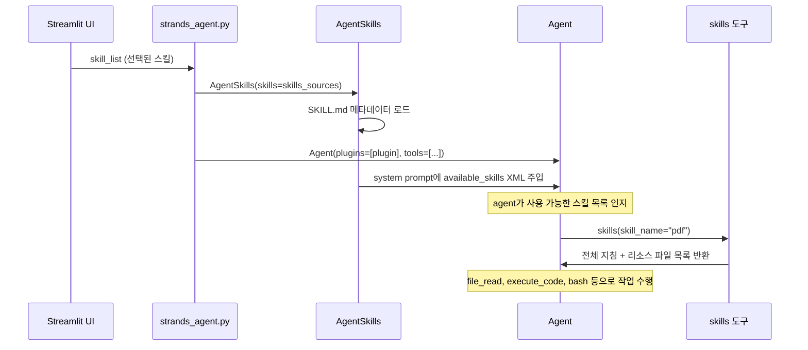

# AgentSkills

Strands SDK의 `AgentSkills` 플러그인을 사용하여 agent에 모듈형 스킬을 연결하는 방법을 설명합니다. 공식 문서는 [Skills | Strands Agents](https://strandsagents.com/docs/user-guide/concepts/plugins/skills/)를 참고하세요.

이 프로젝트에서는 [application/strands_agent.py](./application/strands_agent.py)에서 `AgentSkills`를 적용하고, Streamlit UI([application/app.py](./application/app.py))에서 활성화할 스킬을 선택합니다.

## 개요

`AgentSkills`는 [Agent Skills 사양](https://agentskills.io/specification)을 따르는 플러그인입니다. **Progressive Disclosure**(점진적 공개) 방식으로 동작합니다.

- 시스템 프롬프트에는 스킬의 **이름과 설명만** XML 형태로 주입됩니다.
- agent가 작업에 필요하다고 판단하면 `skills` 도구를 호출하여 **상세 지침을 필요할 때만** 로드합니다.

이렇게 하면 컨텍스트 윈도우를 절약하면서도, PDF 처리·문서 작성·RAG 검색 등 다양한 전문 지침을 하나의 agent에 탑재할 수 있습니다.

### SDK 버전

`AgentSkills`는 **strands-agents 1.30.0**(2026-03-11 릴리스)부터 공식 지원됩니다([릴리스 노트](https://github.com/strands-agents/sdk-python/releases/tag/python%2Fv1.30.0)). 이 프로젝트는 `requirements.txt`에서 `strands-agents[openai]>=1.44.0`(2026-06-16 릴리스)을 요구합니다.

## 스킬이 필요한 이유

agent가 처리하는 업무가 늘어나면 시스템 프롬프트도 함께 비대해집니다. PDF 처리, 데이터 분석, 코드 리뷰, 이메일 작성 등 모든 지침을 한 프롬프트에 넣으면 다음 문제가 생깁니다.

| 문제 | 설명 |
|------|------|
| 컨텍스트 낭비 | 큰 프롬프트가 추론·대화에 쓸 토큰을 소모합니다 |
| 지침 혼선 | 서로 다른 지침이 많으면 모델이 따르기 어렵습니다 |
| 유지보수 부담 | 거대한 단일 프롬프트는 수정·공유·버전 관리가 어렵습니다 |

스킬은 지침을 **자기 완결형 패키지**로 분리합니다. agent는 사용 가능한 스킬 목록만 보고, 필요할 때 해당 스킬의 전체 지침을 열어봅니다.

## 동작 방식 (3단계)



1. **Discovery** — 초기화 시 스킬 메타데이터(name, description)를 읽어 시스템 프롬프트에 `<available_skills>` XML을 주입합니다.
2. **Activation** — agent가 스킬이 필요하다고 판단하면 `skills` 도구를 호출합니다. 전체 지침, 메타데이터, `scripts/`·`references/`·`assets/` 리소스 목록이 반환됩니다.
3. **Execution** — 로드된 지침에 따라 agent가 등록된 도구(`file_read`, `execute_code`, `bash` 등)로 작업을 수행합니다.

주입되는 XML 예시:

```xml
<available_skills>
<skill>
<name>pdf</name>
<description>Extract text and tables from PDF files.</description>
<location>/path/to/application/skills/pdf/SKILL.md</location>
</skill>
</available_skills>
```

이 XML은 **매 invocation 전에 갱신**되므로, 런타임에 스킬을 추가·교체하면 다음 호출부터 반영됩니다. 활성화된 스킬은 `agent.state`에 저장되어 세션 내에서 유지됩니다.

## 공식 Usage 패턴

[공식 문서 Usage](https://strandsagents.com/docs/user-guide/concepts/plugins/skills/#usage)에 따르면 `AgentSkills`는 다음 형태의 스킬 소스를 받습니다.

```python
from strands import Agent, AgentSkills, Skill

# 단일 스킬 디렉터리
plugin = AgentSkills(skills="./skills/pdf-processing")

# 부모 디렉터리 — SKILL.md가 있는 하위 디렉터리를 모두 로드
plugin = AgentSkills(skills="./skills/")

# 혼합 소스
plugin = AgentSkills(skills=[
    "./skills/pdf-processing",
    "./skills/",
    Skill(
        name="custom-greeting",
        description="Generate custom greetings",
        instructions="Always greet the user by name with enthusiasm.",
    ),
])

agent = Agent(plugins=[plugin])
```

`AgentSkills`는 **스킬 발견과 활성화만** 담당합니다. 리소스 파일 읽기·스크립트 실행은 별도 도구를 agent에 등록해야 합니다.

```python
from strands import Agent, AgentSkills
from strands_tools import file_read, shell

plugin = AgentSkills(skills="./skills/")
agent = Agent(
    plugins=[plugin],
    tools=[file_read, shell],
)
```

## 이 프로젝트에서의 적용

### 디렉터리 구조

스킬은 `application/skills/` 아래에 `SKILL.md`를 포함한 디렉터리로 관리합니다.

```
application/skills/
├── pdf/
│   └── SKILL.md
├── docx/
│   └── SKILL.md
├── skill-creator/
│   └── SKILL.md
└── ...
```

| 스킬 | 설명 |
|------|------|
| pdf | PDF 읽기/병합/분할/OCR/폼 처리 |
| notion | Notion API를 통한 페이지/DB/블록 관리 |
| memory-manager | MEMORY.md 기반 대화 메모리 관리 |
| docx | Word 문서 생성/편집/분석 |
| xlsx | 스프레드시트 작업/모델링 |
| pptx | PowerPoint 읽기/편집/생성 |
| myslide | AWS 테마 프레젠테이션 생성 |
| retrieve | Bedrock Knowledge Base RAG 검색 |
| skill-creator | 새로운 스킬 설계/패키징 가이드 |
| seoul-subway | 서울 지하철 실시간 도착/경로/운행 정보 |

### 1. import 및 경로 설정

`strands_agent.py` 상단에서 SDK의 `AgentSkills`, `Skill`을 import하고 스킬 디렉터리를 정의합니다.

```python
from strands import Agent, tool, AgentSkills, Skill

WORKING_DIR = os.path.dirname(os.path.abspath(__file__))
SKILLS_DIR = os.path.join(WORKING_DIR, "skills")
```

시스템 프롬프트에는 스킬 활용 워크플로를 명시합니다. agent가 `skills` 도구로 지침을 로드한 뒤, `file_read`·`execute_code`·`bash` 등으로 작업하도록 안내합니다.

```python
BASE_SYSTEM_PROMPT = (
    "당신의 이름은 서연이고, 질문에 친근한 방식으로 대답하도록 설계된 대화형 AI입니다.\n"
    ...
    "## Agent Workflow\n"
    "1. 사용자 입력을 받는다\n"
    "2. 요청에 맞는 skill이 있으면 skills 도구로 해당 skill의 상세 지침을 로드한다\n"
    "3. skill 지침에 따라 file_read, file_write, execute_code, bash 등의 도구를 사용하여 작업을 수행한다\n"
    "4. execute_code와 bash의 작업 디렉터리는 application/artifacts/이다. 결과 파일은 이 디렉터리에 파일명만으로 저장한다 (예: report.docx, chart.png)\n"
    "5. 있으면 upload_file_to_s3로 업로드하여 URL을 제공한다\n"
    "6. 최종 결과를 사용자에게 전달한다\n"
)
```

### 2. UI용 스킬 목록 조회

Streamlit 체크박스에 표시할 스킬 목록은 `Skill.from_file()`로 `application/skills/`를 스캔합니다.

```python
def available_skills() -> list[dict]:
    """Return name/description for skills under SKILLS_DIR (for UI selection)."""
    result = []
    if not os.path.isdir(SKILLS_DIR):
        return result
    for entry in sorted(os.listdir(SKILLS_DIR)):
        skill_dir = os.path.join(SKILLS_DIR, entry)
        skill_md = os.path.join(skill_dir, "SKILL.md")
        if os.path.isfile(skill_md):
            try:
                loaded = Skill.from_file(skill_dir)
                result.append({
                    "name": loaded.name,
                    "description": loaded.description,
                    "dir": entry,
                })
            except Exception as e:
                logger.warning(f"Failed to load skill '{entry}': {e}")
    return result
```

`app.py`에서는 이 함수로 스킬 체크박스를 렌더링하고, 선택 결과를 `config.json`의 `default_skills`에 저장합니다.

```python
available_skill_info = strands_agent.available_skills()
for s in available_skill_info:
    skill_selections[s["name"]] = st.checkbox(
        s["name"], help=s["description"], ...
    )
selected_skills = [name for name, is_selected in skill_selections.items() if is_selected]
```

### 3. 스킬 이름 → 디렉터리 경로 변환

UI/config에는 `SKILL.md` frontmatter의 `name`(예: `seoul-subway`)이 저장됩니다. 실제 폴더명(예: `subway`)과 다를 수 있으므로, `resolve_skill_dir()`로 경로를 해석합니다.

```python
def resolve_skill_dir(skill_key: str) -> Optional[str]:
    """Map skill name (SKILL.md frontmatter) or directory name to skill path."""
    for entry in sorted(os.listdir(SKILLS_DIR)):
        skill_dir = os.path.join(SKILLS_DIR, entry)
        skill_md = os.path.join(skill_dir, "SKILL.md")
        if not os.path.isfile(skill_md):
            continue
        if entry == skill_key:
            return skill_dir
        try:
            loaded = Skill.from_file(skill_dir)
            if loaded.name == skill_key:
                return skill_dir
        except Exception as e:
            logger.warning(f"Failed to load skill '{entry}': {e}")
    return None


def skill_dirs_from_list(skill_list: list[str]) -> list[str]:
    """Resolve UI/config skill keys to filesystem directories for AgentSkills."""
    dirs: list[str] = []
    for key in skill_list:
        path = resolve_skill_dir(key)
        if path:
            dirs.append(path)
    return dirs
```

### 4. Agent 생성 — AgentSkills 등록

선택된 스킬 디렉터리 경로를 `AgentSkills`에 전달하고, `Agent`의 `plugins` 파라미터로 등록합니다. 스킬이 하나도 선택되지 않으면 플러그인 없이 agent를 생성합니다.

```python
def create_agent(strands_tools: list[str], mcp_servers: list[str], skill_list: list[str]):
    """Create Agent with Strands AgentSkills plugin for selected skills."""
    init_mcp_clients(mcp_servers)

    tools = update_tools(strands_tools, mcp_servers)

    model = get_model()

    skills_sources = skill_dirs_from_list(skill_list)
    logger.info(f"skill_list: {skill_list} -> skills_sources: {skills_sources}")

    skills_plugin = AgentSkills(skills=skills_sources) if skills_sources else None

    agent = Agent(
        model=model,
        system_prompt=BASE_SYSTEM_PROMPT,
        tools=tools,
        plugins=[skills_plugin] if skills_plugin else [],
        conversation_manager=conversation_manager,
    )

    return agent
```

공식 문서의 기본 패턴과 비교하면, 이 프로젝트는 다음을 추가로 적용합니다.

| 항목 | 공식 예시 | 이 프로젝트 |
|------|-----------|-------------|
| 스킬 소스 | `"./skills/"` 고정 경로 | UI에서 선택한 스킬만 `skill_dirs_from_list()`로 해석 |
| 시스템 프롬프트 | 별도 지정 없음 | `BASE_SYSTEM_PROMPT`에 워크플로 명시 |
| 도구 | `file_read`, `shell` | `execute_code`, `bash`, `upload_file_to_s3` + strands_tools + MCP |
| 플러그인 조건 | 항상 등록 | 선택된 스킬이 있을 때만 `AgentSkills` 등록 |

### 5. 리소스 접근용 도구

`AgentSkills`가 자동 등록하는 `skills` 도구 외에, 스킬 지침 실행에 필요한 도구를 agent에 별도로 등록합니다.

```python
def get_builtin_tools() -> list:
    """Built-in tools paired with AgentSkills (skills tool is registered by the plugin)."""
    return [execute_code, bash, upload_file_to_s3]


def update_tools(strands_tools: list, mcp_servers: list):
    tools = get_builtin_tools()

    tool_map = {
        "current_time": current_time,
        "file_read": file_read,
        "file_write": file_write
    }

    for tool_item in strands_tools:
        if isinstance(tool_item, str) and tool_item in tool_map:
            tools.append(tool_map[tool_item])
        ...
    # MCP 도구 추가
    return tools
```

| 역할 | 도구 | 제공 |
|------|------|------|
| 스킬 활성화 | `skills` | `AgentSkills` (자동 등록) |
| 파일 읽기/쓰기 | `file_read`, `file_write` | strands_tools (UI에서 선택) |
| Python 실행 | `execute_code` | strands_agent 내장 |
| 셸/Node 실행 | `bash` | strands_agent 내장 |
| 결과 업로드 | `upload_file_to_s3` | strands_agent 내장 |
| 외부 API | MCP 도구 | MCP 서버 (UI에서 선택) |

`execute_code`와 `bash`는 `application/artifacts/`를 작업 디렉터리로 사용합니다. 생성된 파일은 이 경로에 저장하고, 필요 시 S3에 업로드합니다.

### 6. Agent 실행

`app.py`의 Agent 모드에서 선택된 `skill_list`를 `run_strands_agent()`에 전달합니다. 도구·MCP·스킬 구성이 바뀌면 agent를 재생성합니다.

```python
async def run_strands_agent(query: str, strands_tools: list[str], mcp_servers: list[str],
                            skill_list: list[str], notification_queue):
    global agent, selected_strands_tools, selected_mcp_servers, selected_skill_list

    if (selected_strands_tools != strands_tools
            or selected_mcp_servers != mcp_servers
            or selected_skill_list != skill_list):
        selected_skill_list = skill_list
        agent = create_agent(strands_tools, mcp_servers, skill_list)
        ...

    agent_stream = agent.stream_async(query)
    async for event in agent_stream:
        ...
```

`app.py` 호출부:

```python
if mode == 'Agent':
    skill_list = selected_skills if selected_skills else []
    response, image_urls = asyncio.run(strands_agent.run_strands_agent(
        query=prompt,
        strands_tools=selected_strands_tools,
        mcp_servers=selected_mcp_servers,
        skill_list=skill_list,
        notification_queue=notification_queue))
```

## SKILL.md 형식

스킬은 `SKILL.md` 파일이 있는 디렉터리로 정의합니다. YAML frontmatter와 마크다운 본문으로 구성됩니다.

```markdown
---
name: pdf-processing
description: Extract text and tables from PDF files
allowed-tools: file_read shell
---

# PDF processing

You are a PDF processing expert. When asked to extract content from a PDF:

1. Use `shell` to run the extraction script at `scripts/extract.py`
2. Use `file_read` to review the output
3. Summarize the extracted content for the user
```

| 필드 | 필수 | 설명 |
|------|------|------|
| `name` | Yes | 고유 식별자. 소문자·숫자·하이픈, 1–64자 |
| `description` | Yes | 스킬 설명. 시스템 프롬프트에 표시됨 |
| `allowed-tools` | No | 사용할 도구 이름 목록 (현재는 정보 제공용) |
| `metadata` | No | 추가 key-value 메타데이터 |
| `license` | No | 라이선스 식별자 |
| `compatibility` | No | 호환성 정보 |

리소스 디렉터리:

```
my-skill/
├── SKILL.md
├── scripts/       # 실행 가능한 스크립트
├── references/    # 참고 문서
└── assets/        # 템플릿, 설정, 데이터 파일
```

스킬 활성화 시 리소스 파일 목록이 반환되며, agent는 등록된 `file_read`·`bash`·`execute_code` 등으로 접근합니다.

## AgentSkills 설정 파라미터

| 파라미터 | 타입 | 기본값 | 설명 |
|----------|------|--------|------|
| `skills` | `SkillSources` | (필수) | 경로, HTTPS URL, `Skill` 인스턴스 또는 혼합 |
| `state_key` | `str` | `"agent_skills"` | `agent.state`에 저장할 키 |
| `max_resource_files` | `int` | `20` | 활성화 응답에 포함할 최대 리소스 파일 수 |
| `strict` | `bool` | `False` | `True`이면 검증 오류 시 예외 발생 |

이 프로젝트는 기본값을 그대로 사용합니다.

```python
skills_plugin = AgentSkills(skills=skills_sources)
```

## 다른 접근 방식과의 비교

| 접근 | 적합한 경우 | 트레이드오프 |
|------|-------------|--------------|
| 시스템 프롬프트 | 항상 필요한 소규모 지침 | 역량이 늘수록 비대해짐 |
| [Steering](https://strandsagents.com/docs/user-guide/concepts/plugins/steering/) | 동적·맥락 기반 가이드 | 설정이 더 복잡 |
| **Skills** | 모듈형 도메인별 지침 | 활성화에 도구 호출 1회 필요 |
| Multi-agent | 역할·모델이 근본적으로 다른 경우 | 복잡도·지연 증가 |

단일 agent가 다양한 업무를 처리하되, 모든 지침을 한꺼번에 로드하지 않으려면 Skills가 적합합니다.

## 관련 링크

- [Strands Skills 공식 문서](https://strandsagents.com/docs/user-guide/concepts/plugins/skills/)
- [Strands Plugins 개요](https://strandsagents.com/docs/user-guide/concepts/plugins/)
- [Agent Skills 사양](https://agentskills.io/specification)
- [이 프로젝트 README — 스킬 동작 흐름](./README.md)
