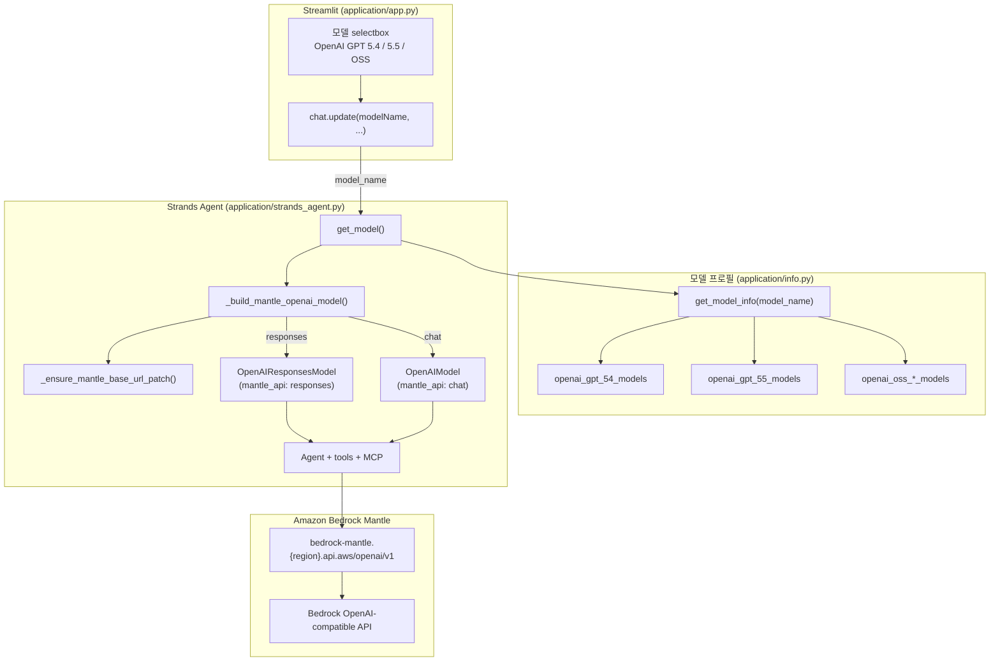

# Strands Agent에서 OpenAI GPT 모델 활용하기

여기에서는 [Strands Agent](https://strandsagents.com/0.1.x/)에서 Amazon Bedrock의 OpenAI GPT 모델(GPT 5.4, GPT 5.5, GPT OSS)을 활용하는 방법을 설명합니다. OpenAI 호환 모델은 Bedrock Runtime의 `invoke_model`이 아닌 **Bedrock Mantle** API를 통해 호출됩니다. Mantle은 OpenAI Chat Completions / Responses API와 호환되는 엔드포인트를 제공하며, Strands SDK의 `OpenAIModel`, `OpenAIResponsesModel`과 연결하여 Agent 모드에서 tool calling을 지원합니다.

현재 지원하는 GPT 모델은 아래와 같습니다.

| UI 표시 이름 | Bedrock model_id | Mantle API | 리전 |
|-------------|------------------|------------|------|
| OpenAI GPT 5.4 | `openai.gpt-5.4` | `responses` | us-west-2, us-east-2 |
| OpenAI GPT 5.5 | `openai.gpt-5.5` | `responses` | us-east-2 |
| OpenAI OSS 120B | `openai.gpt-oss-120b-1:0` | `chat` | us-west-2 |
| OpenAI OSS 20B | `openai.gpt-oss-20b-1:0` | `chat` | us-west-2 |


## GPT 모델 설정 Architecture

GPT 모델 설정은 **UI 선택 → 모델 프로필 조회 → Mantle 모델 생성 → Agent 실행** 순으로 이루어집니다.



| 구성 요소 | 파일 | 역할 |
|-----------|------|------|
| 모델 선택 UI | `application/app.py` | Streamlit selectbox에서 GPT 모델 이름 선택 |
| 모델 프로필 | `application/info.py` | model_id, bedrock_region, mantle_api 정의 |
| 전역 상태 | `application/chat.py` | `model_name`, `model_type` 등 런타임 상태 관리 |
| Mantle 연동 | `application/strands_agent.py` | `OpenAIModel` / `OpenAIResponsesModel` 생성 |
| Agent 실행 | `application/strands_agent.py` | `run_strands_agent()`에서 tool + MCP와 함께 추론 |


## 모델 프로필 정의 (info.py)

[info.py](./application/info.py)에서 각 GPT 모델의 Bedrock 프로필을 정의합니다. 프로필은 `bedrock_region`, `model_type`, `model_id`, `mantle_api` 필드로 구성됩니다.

- **`model_type: "openai"`** — Claude/Nova와 구분하여 Mantle 경로로 라우팅합니다.
- **`mantle_api`** — Mantle에서 사용할 OpenAI 호환 API 종류를 지정합니다.
  - `"responses"`: GPT 5.4, 5.5 등 Responses API 기반 모델
  - `"chat"`: GPT OSS 등 Chat Completions API 기반 모델

```python
openai_gpt_54_models = [
    {
        "bedrock_region": "us-west-2", # Oregon
        "model_type": "openai",
        "model_id": "openai.gpt-5.4",
        "mantle_api": "responses",
    },
    {
        "bedrock_region": "us-east-2", # Ohio
        "model_type": "openai",
        "model_id": "openai.gpt-5.4",
        "mantle_api": "responses",
    },
]

openai_gpt_55_models = [
    {
        "bedrock_region": "us-east-2", # Ohio
        "model_type": "openai",
        "model_id": "openai.gpt-5.5",
        "mantle_api": "responses",
    },
]

openai_oss_120b_models = [
    {
        "bedrock_region": "us-west-2", # Oregon
        "model_type": "openai",
        "model_id": "openai.gpt-oss-120b-1:0",
        "mantle_api": "chat",
    }
]
```

UI에서 선택한 표시 이름을 프로필 목록으로 변환하는 `get_model_info()`에 GPT 모델 분기를 추가합니다.

```python
def get_model_info(model_name):
    models = []
    ...
    elif model_name == "OpenAI GPT 5.4":
        models = openai_gpt_54_models
    elif model_name == "OpenAI GPT 5.5":
        models = openai_gpt_55_models
    elif model_name == "OpenAI OSS 120B":
        models = openai_oss_120b_models
    elif model_name == "OpenAI OSS 20B":
        models = openai_oss_20b_models

    return models
```

리전별로 여러 프로필을 등록하면, `get_model()`에서 `model_profiles[0]`(첫 번째 리전)을 사용합니다. 특정 리전을 우선하려면 배열 순서를 조정합니다.


## Streamlit에서 모델 선택 (app.py)

[app.py](./application/app.py)의 sidebar selectbox에 GPT 모델 이름을 추가합니다. 표시 이름은 `info.py`의 `get_model_info()` 분기와 **정확히 일치**해야 합니다.

```python
modelName = st.selectbox(
    '🖊️ 사용 모델을 선택하세요',
    (
        "Claude 4.6 Sonnet",
        ...
        "OpenAI GPT 5.4",
        "OpenAI GPT 5.5",
        "OpenAI OSS 120B",
        "OpenAI OSS 20B",
        ...
    ), index=0
)
```

선택된 모델은 `chat.update()`를 통해 전역 상태에 반영됩니다.

```python
chat.update(modelName, reasoningMode, debugMode, skillMode)
```

GPT 모델(`model_type == "openai"`)은 Claude의 extended thinking(Reasoning)을 지원하지 않으므로, Agent 모드에서 GPT를 선택하면 Reasoning 설정은 적용되지 않습니다.


## Bedrock Mantle 연동 (strands_agent.py)

Agent 모드에서 GPT 모델을 사용할 때 [strands_agent.py](./application/strands_agent.py)의 `get_model()`이 Mantle 기반 OpenAI 모델을 생성합니다.

### Mantle URL 패치

Strands SDK가 Mantle 엔드포인트 URL을 올바르게 구성하도록 `_MANTLE_BASE_URL`을 패치합니다.

```python
_MANTLE_BASE_URL = "https://bedrock-mantle.{region}.api.aws/openai/v1"
_mantle_url_patch_applied = False

def _ensure_mantle_base_url_patch() -> None:
    """Work around missing /openai path in SDK until harness-sdk#2706 lands."""
    global _mantle_url_patch_applied
    if _mantle_url_patch_applied:
        return
    import strands.models._openai_bedrock as openai_bedrock

    openai_bedrock._MANTLE_BASE_URL_TEMPLATE = _MANTLE_BASE_URL
    _mantle_url_patch_applied = True
```

### mantle_api에 따른 모델 생성

`_build_mantle_openai_model()`은 `info.py`의 `mantle_api` 값에 따라 서로 다른 Strands 모델 클래스를 반환합니다.

```python
def _build_mantle_openai_model(profile: dict, boto_session, max_output_tokens: int):
    """Route OpenAI-compatible Bedrock models through Bedrock Mantle."""
    _ensure_mantle_base_url_patch()

    bedrock_region = profile["bedrock_region"]
    model_id = profile["model_id"]
    mantle_api = profile.get("mantle_api", "chat")
    mantle_config = {"region": bedrock_region, "boto_session": boto_session}

    if mantle_api == "responses":
        return OpenAIResponsesModel(
            model_id=model_id,
            bedrock_mantle_config=mantle_config,
            params={
                "max_output_tokens": max_output_tokens,
                "temperature": 0.1,
            },
        )

    return OpenAIModel(
        model_id=model_id,
        bedrock_mantle_config=mantle_config,
        params={
            "max_tokens": max_output_tokens,
            "temperature": 0.1,
        },
    )
```

| mantle_api | Strands 클래스 | 대상 모델 | 파라미터 |
|------------|---------------|----------|---------|
| `responses` | `OpenAIResponsesModel` | GPT 5.4, GPT 5.5 | `max_output_tokens` |
| `chat` | `OpenAIModel` | GPT OSS 120B, 20B | `max_tokens` |

### get_model() 분기

`get_model()`은 `info.get_model_info(chat.model_name)`으로 프로필을 조회한 뒤, `model_type`에 따라 모델을 생성합니다. OpenAI 타입은 Mantle 경로로, Claude/Nova는 기존 `BedrockModel` 경로로 처리합니다.

```python
def get_model():
    model_profiles = info.get_model_info(chat.model_name)
    if not model_profiles:
        raise RuntimeError(f"No Bedrock profile for model_name={chat.model_name!r}")
    profile = model_profiles[0]
    ...
    model_type = profile["model_type"]

    if chat.reasoning_mode == "Enable" and model_type != "openai":
        model = BedrockModel(...)       # Claude/Nova + Reasoning
    elif chat.reasoning_mode == "Disable" and model_type != "openai":
        model = BedrockModel(...)       # Claude/Nova
    elif model_type == "openai":
        model = _build_mantle_openai_model(profile, boto_session, maxOutputTokens)

    return model
```

생성된 모델은 `create_agent()`에서 Strands `Agent`에 전달되어 tool calling과 MCP 연동이 이루어집니다.


## GPT 모델 동작 흐름

Agent 모드에서 GPT 모델을 선택했을 때의 동작 흐름은 다음과 같습니다.

1. **UI 선택**: Streamlit sidebar에서 `OpenAI GPT 5.4` 등을 선택합니다.
2. **상태 갱신**: `chat.update()`가 `model_name`을 갱신합니다.
3. **Agent 실행**: 사용자 입력 시 `strands_agent.run_strands_agent()`가 호출됩니다.
4. **모델 생성**: `get_model()` → `info.get_model_info()` → `_build_mantle_openai_model()` 순으로 Mantle 모델을 생성합니다.
5. **추론**: Agent가 GPT 모델 + strands_tools + MCP 도구를 사용하여 응답을 생성합니다.

> **참고**: GPT 모델의 Mantle 연동은 **Agent 모드**(`strands_agent.run_strands_agent`)에서 완전히 지원됩니다. 일상적인 대화·RAG 모드는 `chat.get_chat()`의 LangChain `ChatBedrock`(Bedrock Runtime)을 사용하므로, GPT 모델 사용 시 Agent 모드를 권장합니다.


## 새 GPT 모델 추가하기

새 OpenAI 호환 Bedrock 모델을 추가하려면 아래 3곳을 수정합니다.

### 1. info.py — 프로필 등록

```python
openai_gpt_XX_models = [
    {
        "bedrock_region": "us-west-2",
        "model_type": "openai",
        "model_id": "openai.gpt-XX",
        "mantle_api": "responses",  # 또는 "chat"
    },
]

# get_model_info()에 분기 추가
elif model_name == "OpenAI GPT XX":
    models = openai_gpt_XX_models
```

### 2. app.py — selectbox 항목 추가

```python
"OpenAI GPT XX",
```

### 3. mantle_api 선택 기준

- Bedrock 콘솔 또는 [list-foundation-models](https://docs.aws.amazon.com/cli/latest/reference/bedrock/list-foundation-models.html) CLI로 model_id와 지원 리전을 확인합니다.
- Responses API 전용 모델 → `mantle_api: "responses"`
- Chat Completions API 모델 → `mantle_api: "chat"`

`strands_agent.py`의 Mantle 연동 코드는 `mantle_api` 값만으로 분기하므로, 새 모델 추가 시 별도 수정이 필요하지 않습니다.


## 리전별 모델 확인

사용 가능한 OpenAI 모델을 확인하는 방법은 아래와 같습니다.

```text
aws bedrock list-foundation-models --region=us-west-2 --by-provider openai --query "modelSummaries[*].modelId"
```

```text
aws bedrock list-foundation-models --region=us-east-2 --by-provider openai --query "modelSummaries[*].modelId"
```


## Reference

[Amazon Bedrock - OpenAI models](https://docs.aws.amazon.com/bedrock/latest/userguide/model-parameters-openai.html)

[Strands Agents SDK - OpenAI Model](https://strandsagents.com/latest/user-guide/concepts/model-providers/openai/)

[Strands Python Example](https://github.com/strands-agents/docs/tree/main/docs/examples/python)

[info.py](./application/info.py)

[strands_agent.py](./application/strands_agent.py)

[app.py](./application/app.py)
